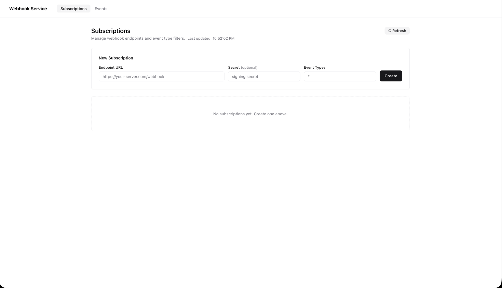
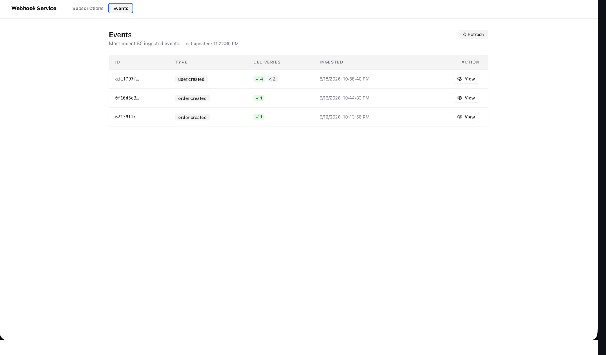
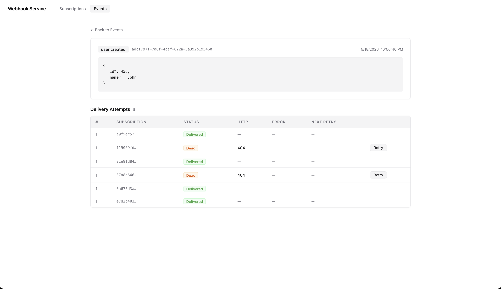

# Webhook Delivery Service

Single-process webhook delivery service. At-least-once delivery, exponential backoff retries, HMAC-SHA256 signing, React dashboard.

## Project Structure

```
Fibr/
├── server/            # Express API + delivery worker (TypeScript)
│   ├── src/
│   ├── tests/
│   ├── tsconfig.json
│   ├── package.json
│   └── .env
├── client/            # React SPA (Vite)
│   ├── src/
│   ├── index.html
│   ├── vite.config.ts
│   └── .env
├── package.json       # Root — orchestration scripts only
├── DECISIONS.md
├── AI_LOG.md
└── README.md
```

## Setup

```bash
# Install all deps
npm install              # root (concurrently)
cd server && npm install # server deps
cd client && npm install # client deps
```

## Run

```bash
npm start        # builds client + server, starts on :3000
```

Open http://localhost:3000

## Dev (hot reload)

```bash
npm run dev      # server (tsx watch) + client (vite) concurrently
```

## Tests

```bash
npm test         # runs vitest in server/
```

## What works

- Subscription CRUD with event type filters — exact (`order.created`) and wildcard (`user.*`, `*`)
- Event ingest with transactional fan-out to matching subscriptions
- At-least-once delivery: attempt row written before HTTP call; sweeper resets stale `in_flight` rows using `claimed_at`
- Exponential backoff with full jitter (base 30s, cap 1hr, min 1s floor)
- HMAC-SHA256 signing with 5-min replay window; `x-webhook-delivery-id` header for consumer deduplication
- Bounded concurrency: max 5 simultaneous outbound HTTP calls per worker tick via `p-limit`
- Dashboard: subscriptions list + create, events list, delivery attempt drill-down, manual retry

## Screenshots

### Subscriptions Dashboard



### Create Subscription Form


### Events List with Delivery Status



### Event Detail - Delivery Attempts



## What's incomplete / next steps

- No pagination on events list (capped at 50 rows)
- No e2e test with a real HTTP receiver — would add with `msw` or a local test server
- `IQueue` interface ready to swap to BullMQ + Redis/Postgres for horizontal scale — only `SqliteQueue.ts` changes
- Concurrency limit of 5 is a fixed constant — could be an env var

## Environment variables

### Server (`server/.env`)

```
PORT=3000
ADMIN_KEY=secret
DB_PATH=./data/webhooks.db
MAX_ATTEMPTS=5
WORKER_INTERVAL_MS=5000
INFLIGHT_TIMEOUT_MS=600000
```

| Var                   | Default              | Description                                    |
| --------------------- | -------------------- | ---------------------------------------------- |
| `PORT`                | `3000`               | HTTP port                                      |
| `ADMIN_KEY`           | `secret`             | `X-Admin-Key` header required on all API calls |
| `DB_PATH`             | `./data/webhooks.db` | SQLite file path                               |
| `MAX_ATTEMPTS`        | `5`                  | Max delivery attempts before dead              |
| `WORKER_INTERVAL_MS`  | `5000`               | Worker poll interval                           |
| `INFLIGHT_TIMEOUT_MS` | `600000`             | Stale in-flight reset threshold (10 min)       |

### Client (`client/.env`)

```
VITE_ADMIN_KEY=secret
```

**Note:** `VITE_ADMIN_KEY` must match `ADMIN_KEY` for API authentication to work.

## API Testing (curl examples)

### Create a subscription

curl -X POST http://localhost:3000/api/subscriptions \\
-H 'x-admin-key: secret' \\
-H 'content-type: application/json' \\
-d '{"url":"https://httpbin.org/post","event_types":["*"]}'

### List subscriptions

curl http://localhost:3000/api/subscriptions \\
-H 'x-admin-key: secret'

### Ingest an event

curl -X POST http://localhost:3000/api/events \\
-H 'x-admin-key: secret' \\
-H 'content-type: application/json' \\
-d '{"type":"order.created","payload":{"order_id":123,"amount":99.99}}'

### List events (with delivery summary)

curl http://localhost:3000/api/events \\
-H 'x-admin-key: secret'

### Get event details with delivery attempts

curl http://localhost:3000/api/events/<event_id> \\
-H 'x-admin-key: secret'

### Retry a dead/failed delivery

curl -X POST http://localhost:3000/api/events/<event_id>/retry \\
-H 'x-admin-key: secret' \\
-H 'content-type: application/json' \\
-d '{"attemptId":"<attempt_id>"}'
